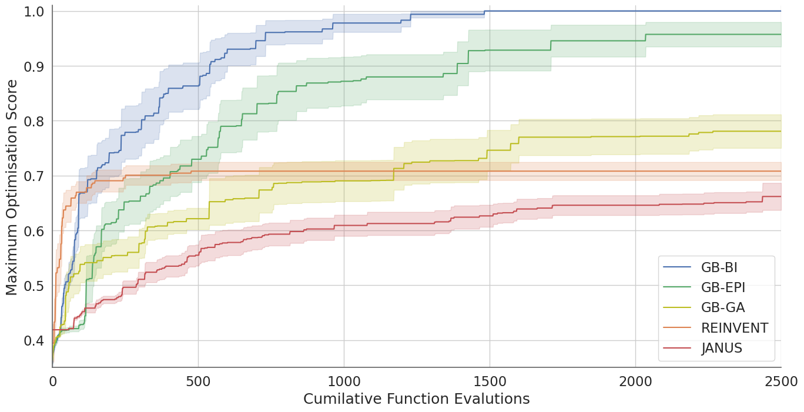

# Graph-Based Bayesian Illumination (GB-BI)

  

**Graph-Based Bayesian Illumination (GB-BI)** is an open-source software library that aims to make state-of-the-art, quality-diversity optimisation techniques infused with Bayesian optimisation easily accessible to scientific experts in medicinal chemistry and cheminformatics. In addition to outperforming both deep generative models and standard genetic algorithms, GB-BI also generates a larger diversity of high-scoring molecules than a standard quality-diversity methods. In this repo, we provide a modular codebase, novel benchmarks, and extensive documentation for GB-BI.

[Overview](#overview) | [Getting Started](#getting-started) | [Documentation](https://jonas-verhellen.github.io/Bayesian-Illumination/index.html#)| [Paper](https://chemrxiv.org/engage/chemrxiv/article-details/667c2bdd5101a2ffa88fae63) | [Benchmarks](https://jonas-verhellen.github.io/Bayesian-Illumination/modules/benchmarks.html) | [Huggingface Space](https://huggingface.co/spaces/jonas-verhellen/Bayesian-Illumination) <!-- | [Docker Image](https://github.com/Jonas-Verhellen/Bayesian-Illumination)  -->

## Overview

Despite a surge of deep learning papers focused on generative models for small molecules, it remains difficult for these models to out-compete more traditional, rule-based approaches such as genetic algorithms. While comparatively efficient, genetic algorithms have two main drawbacks: susceptibility to stagnation and the lack of exploitation of the information encoded in the fitness values of the different molecules generated by the algorithm throughout its optimisation procedure. **Graph-Based Bayesian Illumination** solves both of these issues by combining the stepping-stone properties of quality-diversity methods (to escape stagnation) with the sampling efficiency of Bayesian optimisation.

  

Standard quality-diversity (QD) and Bayesian optimisation (BO) libraries do not cater to particularities of optimising small molecules. Therefore, GB-BI relies on two packages that provide these utilities specifically for small molecules.

* **GB-EPI:** a [quality-diversity software package](https://github.com/Jonas-Verhellen/Argenomic) for the optimisation of small molecules which enforces diversity in chemical space by creating niches based on physicochemical properties.
* **GAUCHE:** a [Gaussian process framework](https://github.com/leojklarner/gauche) for chemistry, providing more than 30 bespoke kernels for small molecules, proteins and chemical reactions.

For the mutatations, crossovers, structural filters and physicochemical descriptors, we rely on [RDKit](https://github.com/rdkit/rdkit). The structural filters are based on a set of [scripts](https://github.com/PatWalters/rd_filters) provided by Patrick Walters. The graph-based mutations and crossovers are inspired by Jan H. Jensen's graph-based genetic algorithm ([GB-GA](https://github.com/jensengroup/GB_GA)). Ideas regarding the application of acquisition functions and Bayesian optimsation to quality-diversity methods were spurred on by the publication of the [BOP-Elites algorithm](https://arxiv.org/abs/2005.04320).

## Getting Started

After installing the software and running the tests, a basic usage example of Bayesian Illumination (i.e. the rediscovery of Troglitazone) can be called upon in the following manner:

    python illuminate.py

This command will call the config file in `configuration` folder and makes use of [Hydra](https://hydra.cc/docs/intro/) for command line overwrites. Hydra is an open-source framework, developed and maintained by Meta Research, that simplifies the development of research and other complex applications. The key feature is the ability to dynamically create a hierarchical configuration by composition and override it through config files and the command line. 

    python illuminate.py fitness.type=Guacamol fitness.target=osimertinib_mpo acquisition.type=EI

As shown in this example, to change the fitness function to the Guacamol multiproperty objective for Osimertinib and to change the acquistion function to the expected improvement (EI) it suffices to add keywords to the call in the command line. 

## Optimisation Efficiency

Recently, it has been asserted that to progress the research field, novel generative molecular models must demonstrate a clear advantage over genetic algorithms. Across various molecular optimisation tasks from independent benchmark suites, Bayesian Illumination consistently achieves state-of-the-art results. According to an analysis detailed in the paper, GB-BI is an order of magnitude more efficient than a standard quality-diversity algorithm and **two orders of magnitude more efficient than a standard genetic algorithm**. 

  

Bayesian Illumination's superior performance is illustrated in the plot above, which shows mean values and standard errors of the maximum optimistation score (Tanimoto similiarty to Troglitazone) in function of the cumulative amount of function calls. Data obtained in ten independent runs of Bayesian Illumination (GB-GI), a standard quality-diversity algorithm (GB-EPI), a standard genetic algorithms (GB-GA), a parallel-tempered genetic algorithm (JANUS) and a representative deep generative model (REINVENT).

## Features and Settings

The GB-BI core functionality covers a plethora of fitness functions, molecular representations, acquisition functions, physicochemical descriptors, and structural filters. A brief overview is provide here, a comprehensive overview can be found in the documentation and in-depth paractical disscussions on the different options for the configuration files are found in the tutorials suppied with the documentation. 

### Fitness Functions

GB-BI provides three classes of fitness functions out-of-the-box: fingerprint-based rediscovery, descriptor-based rediscovery, and SAS-modulated docking scores. These fitness functions can and have been used as benchmark tools to probe the effciency of generative models but also have direct practical applications. Additional fitness functions can easily be added to the codebase.

* **Fingerprint-Based Rediscovery:** A lightweight task focused on molecule rediscovery where the fitness of a molecule is the Tanimoto similarity to the target molecule, based on their respective extended-connectivity fingerprints. Implementation based on Gaucamol.
* **Descriptor-Based Rediscovery:**  An alternative molecule rediscovery task, with intermediate computational expense, where the fitness of a generated molecule is the conformer-aggregated similarity to the target molecule, based on their respective descriptors (USRCAT or Zernike).
* **Guacamol Benchmarks:** These tasks optimise molecules to score highly on the GuacaMol task provided by the TDC oracle: molecular properties, molecular similarity, drug rediscovery, isomers, MPOs, median molecule and a few others.
* **Organic Photovoltaics:** These tasks focus on the design of small organic donor molecules with optimal power conversion efficiency, based on single point GFN2-xTB calculations distilled through an autoML model provided by the Tartarus benchmarking suite.
* **SAS-Modulated Docking Scores:** A computationally intensive task, utilising docking methods which evaluate the theoretical affinity between a small molecule and a target protein. To avoid pure exploitation of the docking method, the scores are modulated by the synthetic accesibility of the small molecule.

### Molecular Representations

GB-BI supports several molecular representation that are based on bit vectors or strings. These representations are used for the surrogate models using the Tanimoto kernel from GAUCHE. The string-based representations are turned into a bag-of-characters before being used in the kernel. Note that several of these vectors representations are currently not natively supported by GAUCHE.

<table>
<thead>
  <tr>
    <th>Representation</th>
    <th>Description</th>
  </tr>
</thead>
<tbody>
  <tr>
    <td rowspan="1">ECFP</td>
    <td> Extended-Connectivity Fingerprints (ECFP) are circular topological fingerprints that represent the presence of particular substructures. </td>
  </tr>
  <tr>
    <td rowspan="1">FCFP</td>
    <td> Functional-Class Fingerprints (FCFP) are circular topological fingerprints that represent the presence of particular pharmacophoric properties. </td>
  </tr>
  <tr>
    <td rowspan="1">RDFP</td>
    <td> RDKit-specific fingerprints (RDFP) are inspired by public descriptions of the Daylight fingerprints, but differ significantly in practical implementation. </td>
  </tr>
  <tr>
    <td rowspan="1">APFP</td>
    <td> Atom pair fingerprints (APFP) encodes all unique triplets of atomic number, number of heavy atom neighbours, aromaticity and chirality in a vector format. </td>
  </tr>
  <tr>
    <td rowspan="1">TTFP</td>
    <td> Topological torsion fingerprints (TTFP) encode the long-range relationships captured in atom pair fingerprints through information on the torsion angles of a molecule. </td>
  </tr>
  <tr>
    <td rowspan="1">SMILES</td>
    <td> The simplified molecular-input line-entry system (SMILES) is a widely used line notation for describing the structure of a small molecule in terms of short ASCII strings. </td>
  </tr>
  <tr>
    <td rowspan="1">SELFIES</td>
    <td> Self-referencing embedded strings (SELFIES) are an alternative line notation for the structure of a small molecule, designed to be used in arbitrary machine learning models. </td>
  </tr>
</tbody>
</table>

### Acquisition Functions

Acquisition functions are heuristics employed to evaluate the potential of candidate moelcules based on their predicted fitness value and the associated uncertainty of a surrogate fitness model (i.e. the Gaussian process). A large literature exists on the topic of acquisition functions and their design. GB-BI supports several of the most well-known and often used acquisition functions.

* **Posterior Mean:** The posterior mean is simply the fitness value as predicted by the surrogate fitness model.
* **Upper Confidence Bound (UCB):** The upper confidence bound balances exploration and exploitation based on a confidence boundary derived from the surrogate fitness model. <!--The upper confidence bound is defined as $\text{UCB}(x) = \mu(x) + \beta \sigma(x)$, where $\mu(\cdot)$ and $\sigma(\cdot)$ are respectively the posterior mean and variance of the surrogate fitness model, $x$ denotes the candidate solution, and  $\beta$ is a hyperparameter representing confidence in the surrogate model.-->
* **Expected Improvement (EI):** The expected improvement considers both the probability of improving on the current solutions and the magnitude of the predicted improvement. <!--The expected improvement is defined as $\text{EI}(x) = \sigma(x) \ h\left((\mu(x) - y)/\sigma(x)\right)$, where $x$ denotes the candidate solution, $\mu(\cdot)$ and $\sigma(\cdot)$ are respectively the posterior mean and variance of the surrogate fitness model, and $y$ is the best fitness function value observed so far. In the above equation, the helper function $h(\cdot)$ is defined as $h(z) = \phi(z) + z \Phi(z)$ where $\phi$ and $\Phi$ are respectively the probability density function and the cumulative density function of the Normal distribution.-->
* **Numerically Stable log(EI) (logEI):** A numerically stable variant of the logarithm of the expected improvement (logEI), which was was recently introduced to alleviate the vanishing gradient problems sometimes encountered in the classical version of EI. <!-- and is defined as $\text{logEI}(x) = \text{log}_h\left((\mu(x) - y)/\sigma(x)\right) + \text{log}(\sigma(x))$ in which the helper function $\text{log}_h(\cdot)$ is a numerical stable implementation of the composite function $\log (h)$.-->

## Installation

Download the source code from Github to your local machine and create the environment from the `bayesian-illumination.yml` file:

    conda env create -f bayesian-illumination.yml

Activate the new environment:

    conda activate bayesian-illumination

Verify that the installion was correct by running the unit tests:

    pytest ./tests
    
## Contributions

If there are any specific fitness functions, molecular representations or acquisition functions that you would like to see included in GB-BI, please open an issue or submit a pull request. More information on how to adapt and extend GB-BI can be found in the documentation.
