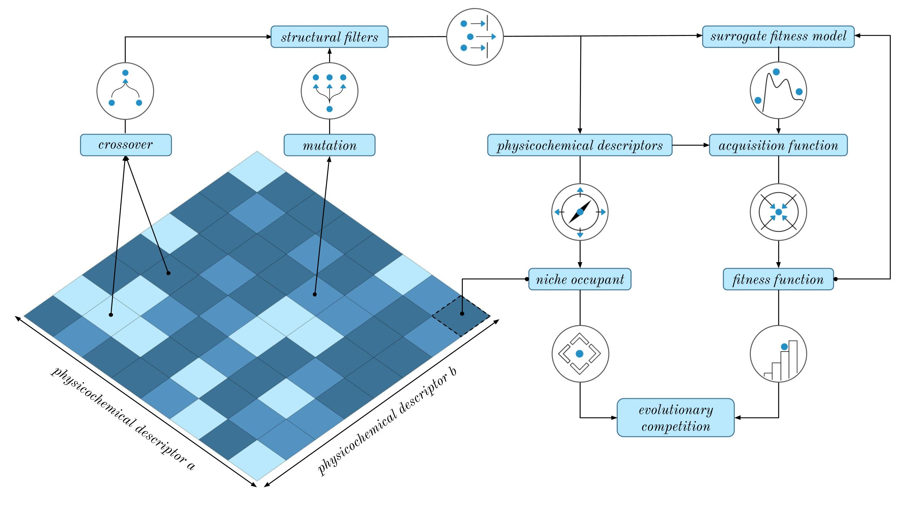

# Graph-Based Bayesian-Illumination (GB-BI)

**Graph-Based Bayesian-Illumination (GB-BI)** is an open-source software library that aims to make state-of-the-art, quality-diversity optimisation techniques easily accessible to scientific experts in medicinal chemistry and cheminformatics. We provide a modular codebase for combining quality-diversity with Bayesian optimisation techniques for small molecules.

[Overview](#overview) | [Getting Started](#getting-started) | [Documentation](https://github.com/Jonas-Verhellen/Bayesian-Illumination) | [Paper](https://arxiv.org)

## Overview

  

Standard quality-diversity (QD) and Bayesian optimisation (BO) libraries do not cater to particularities of optimising small molecules. Therefore, GB-BI relies on two packages that provide these utilities specifically for small molecules:  

* **GB-EPI** a quality-diversity software package for the optimisation of small molecules which enforces diversity in chemical space by creating niches based on physico-chemical properties.
* **GAUCHE** a Gaussian process framework for chemistry, providing more than 30 bespoke kernels for small molecules, proteins and chemical reactions.

### Fitness Functions

### Molecular Representations

GB-BI supports several molecular representation that are based on bit vectors or strings. These representations are used for the surrogate models using the Tanimoto kernel from GAUCHE. The string-based representations are turned into a bag-of-characters before being used in the kernel. Note that several of these vectors representations are currently not natively supported by GAUCHE. 
 
<table>
<thead>
  <tr>
    <th>Representation</th>
    <th>Description</th>
  </tr>
</thead>
<tbody>
  <tr>
    <td rowspan="1">ECFP</td>
    <td> Extended-Connectivity Fingerprints (ECFP) are circular topological fingerprints that represent the presence of particular substructures. </td>
  </tr>
  <tr>
    <td rowspan="1">FCFP</td>
    <td> Functional-Class Fingerprints (FCFP) are circular topological fingerprints that represent the presence of particular pharmacophoric properties. </td>
  </tr>
  <tr>
    <td rowspan="1">RDFP</td>
    <td> RDKit-specific fingerprints (RDFP) are inspired by public descriptions of the Daylight fingerprints, but differ significantly in practical implementation. </td>
  </tr>
  <tr>
    <td rowspan="1">APFP</td>
    <td> Atom pair fingerprints (APFP) encodes all unique triplets of atomic number, number of heavy atom neighbours, aromaticity and chirality in a vector format. </td>
  </tr>
  <tr>
    <td rowspan="1">TTFP</td>
    <td> Topological torsion fingerprints (TTFP) encode the long-range relationships captured in atom pair fingerprints through information on the torsion angles of a molecule. </td>
  </tr>
  <tr>
    <td rowspan="1">SMILES</td>
    <td> The simplified molecular-input line-entry system (SMILES) is a widely used line notation for describing the structure of a small molecule in terms of short ASCII strings. </td>
  </tr>
  <tr>
    <td rowspan="1">SELFIES</td>
    <td> Self-referencing embedded strings (SELFIES) are an alternative line notation for the structure of a small molecule, designed to be used in arbitrary machine learning models. </td>
  </tr>
</tbody>
</table>

### Acquisition Functions

Acquisition functions are heuristics employed to evaluate the potential of candidate moelcules based on their predicted fitness value and the associated uncertainty of a surrogate fitness model (i.e. the Gaussian process). A large literature exists on the topic of acquisition functions and their design. GB-BI supports several of the most well-known and often used acquisition functions. 

* **Posterior Mean:** The posterior mean is simply the fitness value as predicted by the surrogate fitness model.
* **Upper Confidence Bound (UCB):** The upper confidence bound balances exploration and exploitation based on a confidence boundary derived from the surrogate fitness model. The upper confidence bound is defined as $\text{UCB}(x) = \mu(x) + \beta \sigma(x)$, where $\mu(\cdot)$ and $\sigma(\cdot)$ are respectively the posterior mean and variance of the surrogate fitness model, $x$ denotes the candidate solution, and  $\beta$ is a hyperparameter representing confidence in the surrogate model.
* **Expected Improvement (EI):** The expected improvement considers both the probability of improving on the current solutions and the magnitude of the predicted improvement. The expected improvement is defined as $\text{EI}(x) = \sigma(x) \ h\left((\mu(x) - y)/\sigma(x)\right)$, where $x$ denotes the candidate solution, $\mu(\cdot)$ and $\sigma(\cdot)$ are respectively the posterior mean and variance of the surrogate fitness model, and $y$ is the best fitness function value observed so far. In the above equation, the helper function $h(\cdot)$ is defined as $h(z) = \phi(z) + z \Phi(z)$ where $\phi$ and $\Phi$ are respectively the probability density function and the cumulative density function of the Normal distribution.
* **Numerically Stable log(EI):** A numerically stable variant of the logarithm of the expected improvement (logEI), which was was recently introduced to alleviate the vanishing gradient problems sometimes encountered in the classical version of EI and is defined as $\text{logEI}(x) = \text{log}_h\left((\mu(x) - y)/\sigma(x)\right) + \text{log}(\sigma(x))$ in which the helper function $\text{log}_h(\cdot)$ is a numerical stable implementation of the composite function $\log (h)$.

  
### Extensions

If there are any specific acquisition functions or molecular representations that you would like to see included in GB-BI, please open an issue or submit a pull request.

## Getting Started

The easiest way to use GB-BI Gauche is to clone this repository and install the included conda environment. 
