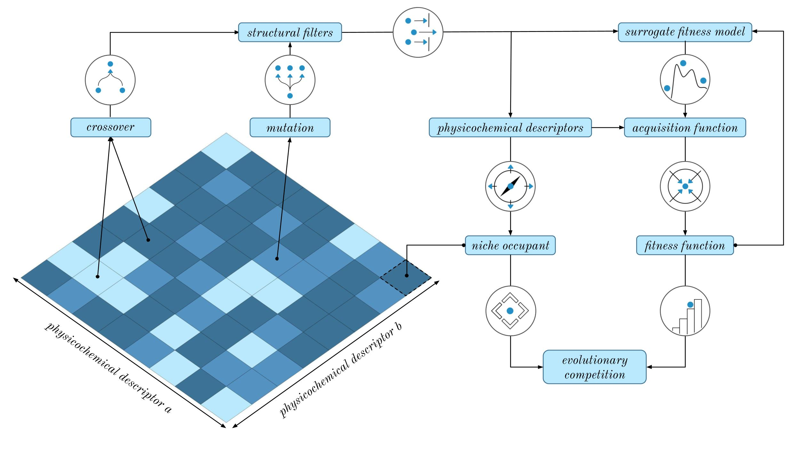

.. GB-BI documentation master file, created by
   sphinx-quickstart on Thu Jun  6 12:05:21 2024.
   You can adapt this file completely to your liking, but it should at least
   contain the root `toctree` directive.

Graph-Based Bayesian Illumination
==================================

**Graph-Based Bayesian Illumination (GB-BI)** is an open-source software library that aims to make state-of-the-art, quality-diversity optimisation techniques infused with Bayesian optimisation easily accessible to scientific experts in medicinal chemistry and cheminformatics. We provide a modular codebase, novel benchmarks, and extensive documentation. Details on the theoretical foundation and the general motivation behind this approach can be found in the `preprint (ChemrXiv 2024) <https://arxiv.org/>`_.

.. image:: ../../imgs/GB-BI-banner-2-compressed.png
    :width: 100 %
    :alt: GB-BI Banner
    :align: center

Overview
==========

Despite a surge of deep learning papers focused on generative models for small molecules, it remains difficult for these models to out-compete more traditional, rule-based approaches such as genetic algorithms. While comparatively efficient, genetic algorithms have two main drawbacks: susceptibility to stagnation (due to diversity collapse in the evolutionary population) and the lack of exploitation of the information encoded in the fitness values of the different molecules generated by the algorithm throughout its optimisation procedure.

**Bayesian Illumination** solves both of these issues by combining the stepping-stone properties of quality-diversity methods (to escape stagnation) with the sampling efficiency of Bayesian optimisation to create a novel generative model that vastly outperforms both deep learning models and genetic algorithms. Random selection from the physicochemical archive, mutations, and crossovers initiate exploration of the search space. Structural filtering further refines molecule selection.

The main novelty of Bayesian illumination compared to a previous quality diversity method for small molecule optimisation is the use of surrogate fitness and acquisition function calculations to inform the selection of a single molecule to be compared in direct evolutionary competition with the current occupant of the niche. This algorithm is applied iteratively, in batches known as generations, until a predetermined fitness function budget is exhausted or the algorithm has converged.

Efficiency
================
Recently, it has been asserted that to progress the research field, novel generative molecular models must demonstrate a clear advantage over genetic algorithms. In response, we present Bayesian Illumination, a novel generative model for small molecules based on Gaussian processes and quality-diversity methods. Across various molecular optimisation tasks from independent benchmark suites, **Bayesian Illumination consistently achieves state-of-the-art results**. This is illsutrated in the plot below, which shows mean values and standard errors of the maximum optimistation score (Tanimoto similiarty to Troglitazone) in function of the cumulative amount of function calls. Data obtained in ten independent runs for Bayesian Illumination (GB-GI), a quality-diversity algorithms (GB-EPI), two genetic algorithms (GB-GA, JANUS) and one deep generative model (REINVENT).

.. image:: ../../imgs/rediscovery.png
    :width: 100 %
    :alt: Efficiency
    :align: center

.. include:: _toctree.rst

GB-BI achieves rediscovery of Troglitazone at an average of 629 fitness function calls. According to the literature, GB-EPI and GB-GA make use of an average of 14,258 and 24,216 fitness function calls, respectively, for a single optimisation run of this task. Note that due to stagnation issues, GB-GA faces requires at least 3 independent optimisation runs (approximately 72,000 fitness function evaluations) to rediscover Troglitazone with a 99% success rate.  Taking stagnation issues and multiple optimisation runs into account, we conclude that (for this task) **GB-BI is 22.67 times more efficient than GB-EPI** and **115.50 times more efficient than GB-GA**. In addition, it is worth noting that Bayesian Illumination also generates a larger diversity of high-scoring molecules than a standard quality-diversity method without Bayesian optimisation.
